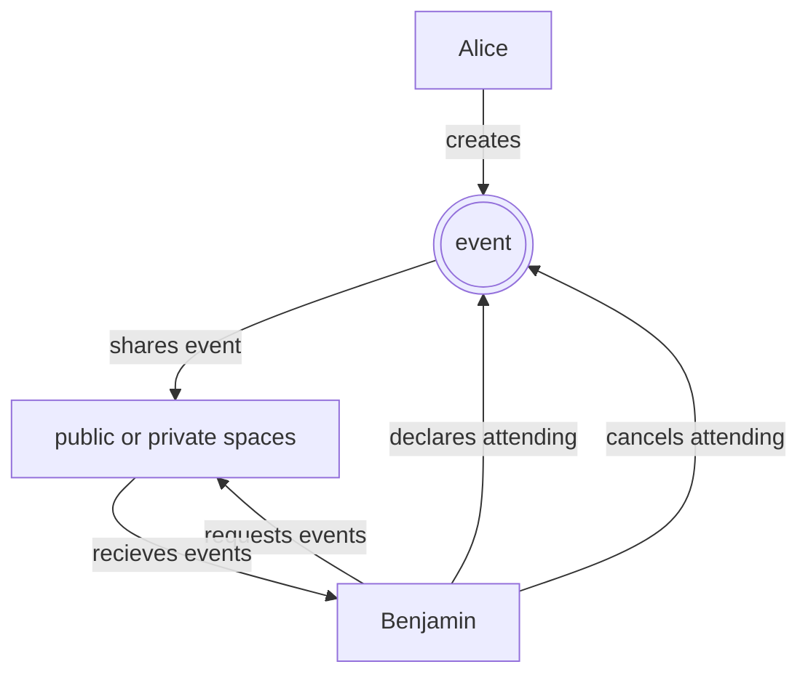
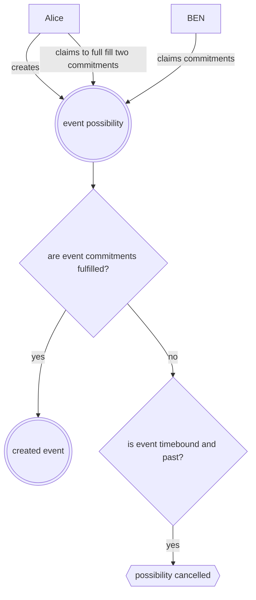

# Gather


## synopsis
Software for co-creating, accessing, and managing emergent events. It could be a meeting for a project, practice session for a martial art, gaming session, hobby hangout, or a big celebration. 

Gather lets you see and actualize previously invisible possibilities for coming together with the people in your life around the things you care about. 

gather is software that enables people to form events in a way that both promotes flexibility and mutual leadership as well as clarifying and making commitments visible.


## overview
the gather application will let people create simple events both within a group or in a more open space.

It will also provide possibilities of granular emergent planning where events come together as the commitments needed to make them real are matched and fulfilled.

Over time, fulfilled commitments and past event experiences will be visible to create higher levels of trust and more reliabile processes. 


## UX flows

### simple event creation



---


### mutual commitments co-creation


## user stories
### basic
- A person should be able to create an event, either open (public) or invite only (private)
- Events could be marked as having a ticket cost, but purchasing is not handled in MVP
- People should be able to mark as attending 
- People should be able to see who else is attending an event
- Doodle-like possibility, these are the times I am available for certain activity (within certain membrane)
- A person should be able to export all their data on what events they have created and attended.
- A person shold be able to export calendar data

### commitments

- Setting up possible/tentative events: - who would like to do this? this is needed for this to happen?
- When I say something is going to happen, how often does it actually happen? 
- See peoples history, how likely is it that people will actually attend?


## design considerations

- events and event possibilities should be able to be shared into many different contexts/membranes
- a Hosted space should be available for making events visible in public
- event, attendance and commitment data should be exportable for each agent
- calendar events should be exportable
- people should be able to use the gather app within WE groups


# Development Documentation
## Environment Setup

> PREREQUISITE: set up the [holochain development environment](https://developer.holochain.org/docs/install/).

Enter the nix shell by running this in the root folder of the repository: 

```bash
nix-shell
npm install
```

**Run all the other instructions in this README from inside this nix-shell, otherwise they won't work**.

## Running 2 agents
 
```bash
npm start
```

This will create a network of 2 nodes connected to each other and their respective UIs.
It will also bring up the Holochain Playground for advanced introspection of the conductors.

## Running the backend tests

```bash
npm test
```

## Bootstrapping a network

Create a custom network of nodes connected to each other and their respective UIs with:

```bash
npm run network 3
```

Substitute the "3" for the number of nodes that you want to bootstrap in your network.
This will also bring up the Holochain Playground for advanced introspection of the conductors.

## Packaging

To package the web happ:
``` bash
npm run package
```

You'll have the `gather.webhapp` in `workdir`. This is what you should distribute so that the Holochain Launcher can install it.
You will also have its subcomponent `gather.happ` in the same folder`.

## Documentation

This repository is using these tools:
- [NPM Workspaces](https://docs.npmjs.com/cli/v7/using-npm/workspaces/): npm v7's built-in monorepo capabilities.
- [hc](https://github.com/holochain/holochain/tree/develop/crates/hc): Holochain CLI to easily manage Holochain development instances.
- [@holochain/tryorama](https://www.npmjs.com/package/@holochain/tryorama): test framework.
- [@holochain/client](https://www.npmjs.com/package/@holochain/client): client library to connect to Holochain from the UI.
- [@holochain-playground/cli](https://www.npmjs.com/package/@holochain-playground/cli): introspection tooling to understand what's going on in the Holochain nodes.
